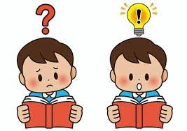

# Refined-Chat-Bot

> Can large language models respond to questions in character, including questions that the character would not know?

## Motivation
Our project goal is to create a chat bot based on either a fictional or real individual that would be able to respond true to character. For a model to truly impersonate a character, it should model their personality and their knowledge. Many models are pretrained on large corpuses that fall outside of the information scope of the actual character or individual, leading them to say uncharacteristic things while in character, and we hope to remedy that problem.
In recent years, with the release of ChatGPT, large language models have been used in all different types of fields and businesses. One such use of large language models has been to replicate the personality and knowledge of certain fictional characters. People have trained numerous models with the dialogue and actions of fictional characters in order to create a chat bot that can respond as their favorite character. However, many of the publicly available chatbots share the same problem: access to knowledge outside of their fictional counterpart's knowledge. As such, our objective is to refine the scope of the chat bot's knowledge and ensure that they answer questions true to character rather than defaulting to the information trained on the base model. In doing so, we hope to be able to train chat bot's on real life individuals to try to predict how a person may respond to a question or situation through training the chat bot on a person's own writing, quotes, and related works. A refined chat bot would be particularly useful to prepare for rebuttals in a debate and prepare for any questions that could potentially be asked. Creating a chat bot based solely on a single individual will also reveal some interesting questions on just how accurate a chatbot could be in replicating a person's speech and just how much of an impact a person's prior beliefs have on their present character.

## Methodology
Our first step was to test a wide range of models to determine which would be the best to work with. We decided to use PyTorch as our machine learning library due to our previous experience with it. We also selected a few different LLM models to test: GPT-2, T5, BART, LLaMA-7b-chat, DialoGPT, and Falcon-7B. Apart from LLaMA, all of these models were obtained from the Transformers library provided by HuggingFace. The models also have similar hyperparameters, such as max_new_tokens and max_length. Other hyperparameter options exist as well, such as the standard batch_size and learning_rate hyperparameters. For our initial testing, we decided to keep these hyperparameters at standard values (3 epochs and a batch size of 4) to make the models easily comparable and see if we can differentiate them early on (fine-tuning these extra hyperparameters will be a part of our future analysis).

Of the 6 models we used as a baseline, only DialoGPT, LLAMA and Falcon-7B were able to respond in a reasonably understandable manner. The rest of the models would either respond in nonsense or simply repeat the same statement multiple times. This matches with the size of each of these models: LLaMA and Falcon-7b have the highest number of parameters, so they are the most likely to perform the best. The other 4 models have similar amounts of parameters. Although DialoGPT has the same number of parameters as GPT-2, because it has been further trained for conversational purposes, it is able to respond more accurately compared to the other 3. For GPT-2, T5, and BART, changing max_new_tokens or max_length, the outputs only repeated the same initial model output with little variation. As a result, we then narrowed down our search to between DialoGPT, Falcon-7B, and LLAMA as they provided the best responses and interesting avenues for research.

About one week into our project process, we discovered a paper that worked on a topic remarkably similar to our project proposal: Large Language Models Meet Harry Potter: A Bilingual Dataset for Aligning Dialogue Agents with Characters (Chen et al. Link).

While the paper does attempt to train a model with the intent that it responds in the same manner as the character Harry Potter, they largely focused on the sentiments and relationships between each character. Although we don't share any of our methodology, the Harry Potter Dataset (HPD) used in this paper is very conveniently aligned for our project, so we will also be using their dataset for training our model as well.

---

## Running the Code
Data parsing and initial EDA is in the `preprocessing` folder. 

For LLaMA, the most relevant files are `models/llama_finetune.sbatch` and `models/llama_finetuned_test.py`. While we were fine tuning, the llama training command was normally run interactively through `srun` instead of `sbatch`, which may result in different behavior. If this is the case, just copy and run the `autotrain` command after setting up `srun`.

For Falcon, `testing_falcon.ipynb` contains all the code to load the pretrained base model, test it, finetune it, save it, and load and test the finetuned model, along with some example outputs. The finetuned version is loaded by using the `adapter_config.json`, `adapter_model.bin`, `special_tokens_map.json`, `tokenizer.json`, and `tokenizer_config.json` files in the `model` folder, and if further trained will save to this folder as well.

---
## Related Works
* <https://arxiv.org/abs/2211.06869>

## Our core development team:
* Matthew Dong [GitHub](https://github.com/Matt-J-Dong)
* Alex Huh [GitHub](https://github.com/Alex-Huh)
* Rockie Jiang [GitHub](https://github.com/rj1551)

## Contributing to the Project:
If you want to contribute to our project, here are the related guidelines: [Link](./CONTRIBUTING.md)
